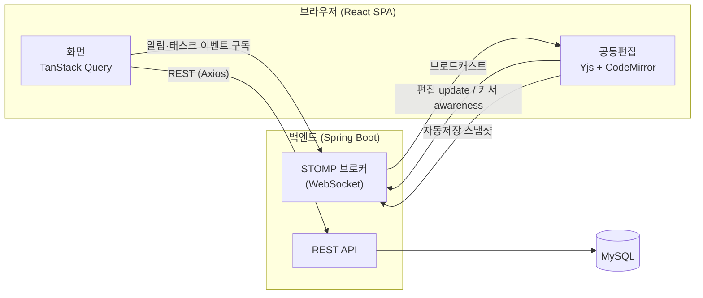
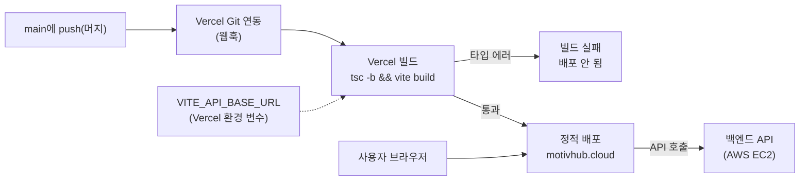

# MotivHub

팀의 작업과 지식을 한 곳에서 관리하는 협업 워크스페이스입니다. 칸반 보드로 태스크를 관리하고, 여러 명이 같은 문서를 실시간으로 함께 편집하며, 이슈 게시판에 트러블슈팅 노하우를 쌓아갈 수 있습니다.

**배포 주소:** https://motivhub.cloud
**백엔드 레포지토리:** [MotivHub_BE](https://github.com/parksamryeong/MotivHub_BE)

<!-- TODO: 스크린샷/GIF 추가 (docs/images/ 에 넣고 아래처럼 참조)


-->

## 주요 기능

- **칸반 보드 & 캘린더**: 드래그 앤 드롭으로 태스크 상태를 변경하고, 보드/캘린더 뷰를 전환해서 볼 수 있습니다. 우선순위, 담당자, 기간, 체크리스트, 태스크 복제를 지원합니다.
- **실시간 공동편집**: 태스크 설명과 노트를 여러 명이 동시에 편집할 수 있습니다. Yjs(CRDT) 기반으로 충돌 없이 병합되며, 현재 같은 태스크를 보고 있는 참여자(presence)도 표시됩니다.
- **대시보드**: 상태별/우선순위별 분포, 담당자별 업무량, 완료 추이를 차트로 보여줍니다. 전체 또는 워크스페이스 단위로 조회할 수 있습니다.
- **내 태스크**: 워크스페이스에 흩어진 내 담당 태스크를 마감일 기준으로 모아서 봅니다.
- **알림**: 실시간 알림(WebSocket)과 알림 유형별 수신 설정, 전체 알림 목록을 제공합니다. 태스크 구독(watch)으로 관심 있는 태스크의 변경을 받아볼 수 있습니다.
- **이슈 게시판**: 트러블슈팅 사례를 글과 댓글로 공유합니다.
- **워크스페이스 협업**: 초대 링크, 멤버 관리, 파일 공유를 지원합니다.
- **인증**: 이메일 인증 회원가입/로그인과 소셜 로그인(Google, GitHub, Kakao)을 지원합니다.

## 기술 스택

| 구분            | 사용 기술                            |
| --------------- | ------------------------------------ |
| 프레임워크      | React 19, TypeScript, Vite           |
| 라우팅          | React Router v7                      |
| 서버 상태       | TanStack Query v5                    |
| 클라이언트 상태 | Zustand                              |
| 스타일링        | Tailwind CSS v4                      |
| 실시간 통신     | STOMP over SockJS (`@stomp/stompjs`) |
| 공동편집        | Yjs (CRDT)                           |
| 드래그 앤 드롭  | dnd-kit                              |
| 차트            | Recharts                             |
| HTTP            | Axios                                |
| 배포            | Vercel                               |

## 아키텍처



- REST 요청은 Axios 인스턴스를 통해 보내며, 액세스 토큰 만료 시 리프레시 토큰으로 갱신 후 재시도합니다.
- 실시간 기능은 하나의 STOMP 연결을 공유하고, 구독은 `subscribeTopic` 레지스트리로 관리합니다. 연결이 끊겼다 재연결되면 남아있는 구독을 자동으로 다시 등록합니다.

## 배포

`main`에 머지되면 Vercel이 저장소를 감지해서 빌드하고 배포합니다. GitHub Actions 워크플로우는 따로 두지 않고, Vercel의 Git 연동만 사용합니다.



- 빌드 명령은 `package.json`의 `build` 스크립트(`tsc -b && vite build`)를 그대로 씁니다. 타입 에러가 있으면 빌드가 실패해서 배포되지 않습니다.
- `VITE_API_BASE_URL`은 `.env`가 아니라 Vercel 대시보드 환경 변수로 주입합니다. `.env`는 gitignore 대상이라 저장소에 없습니다.
- SPA 라우팅을 위해 [`vercel.json`](vercel.json)에 모든 경로를 `index.html`로 보내는 rewrite가 설정되어 있습니다. 이게 없으면 `/oauth/callback` 같은 경로를 직접 열 때 404가 납니다.
- 커스텀 도메인 `motivhub.cloud`는 Cloudflare DNS에서 Vercel로 연결했습니다.

## 폴더 구조

```
src/
├─ api/          # Axios 클라이언트, API 함수, 응답 타입
├─ components/   # 공용 UI 컴포넌트
├─ features/     # 도메인별 화면과 로직
│  ├─ auth/          로그인, 회원가입, OAuth 콜백
│  ├─ dashboard/     통계 차트
│  ├─ issues/        이슈 게시판
│  ├─ notifications/ 알림
│  ├─ tasks/         내 태스크
│  └─ workspaces/    칸반 보드, 태스크 상세, 워크스페이스 설정
├─ layouts/      # 앱 공통 레이아웃(헤더, 내비게이션)
├─ realtime/     # STOMP 클라이언트, 구독 훅, Yjs 공동편집 훅
├─ routes/       # 라우터, 인증 보호 라우트
└─ stores/       # Zustand 스토어(인증 상태)
```

## 트러블슈팅 하이라이트

### 실시간 공동편집에서 늦게 접속한 참여자의 문서 손상

- **문제**: 편집 도중 새로 접속한 참여자가 있으면, 이후 편집 내용이 영구적으로 병합되지 않고 글자가 중복되거나 사라졌습니다.
- **원인**: Yjs는 문서의 각 항목을 `clientID + clock`으로 식별합니다. 각 클라이언트가 REST로 받은 "같은" 초기 텍스트를 자기 clientID로 따로 시딩하면 내용은 같아도 서로 다른 항목이 되어, 이후 편집이 병합되지 않았습니다.
- **해결**: 자동저장 시 평문뿐 아니라 `Y.encodeStateAsUpdate`로 인코딩한 CRDT 바이너리 상태도 함께 저장하고, 접속 시 이 상태를 `Y.applyUpdate`로 복원하도록 시딩 우선순위를 재구성했습니다. 모든 클라이언트가 동일한 바이트에서 시작하므로 구조적 불일치가 발생하지 않습니다.
- 구현: [`src/realtime/useYjsField.ts`](src/realtime/useYjsField.ts)

## 로컬 실행

### 요구 사항

- Node.js 20 이상
- 실행 중인 백엔드 서버 ([MotivHub_BE](https://github.com/parksamryeong/MotivHub_BE))

### 설치 및 실행

```bash
npm install
cp .env.example .env
npm run dev
```

`.env`의 `VITE_API_BASE_URL`에 백엔드 주소를 설정합니다.

```
VITE_API_BASE_URL=http://localhost:8080
```

### 스크립트

| 명령어            | 설명                       |
| ----------------- | -------------------------- |
| `npm run dev`     | 개발 서버 실행             |
| `npm run build`   | 타입 체크 후 프로덕션 빌드 |
| `npm run preview` | 빌드 결과 미리보기         |
| `npm run lint`    | oxlint 실행                |
